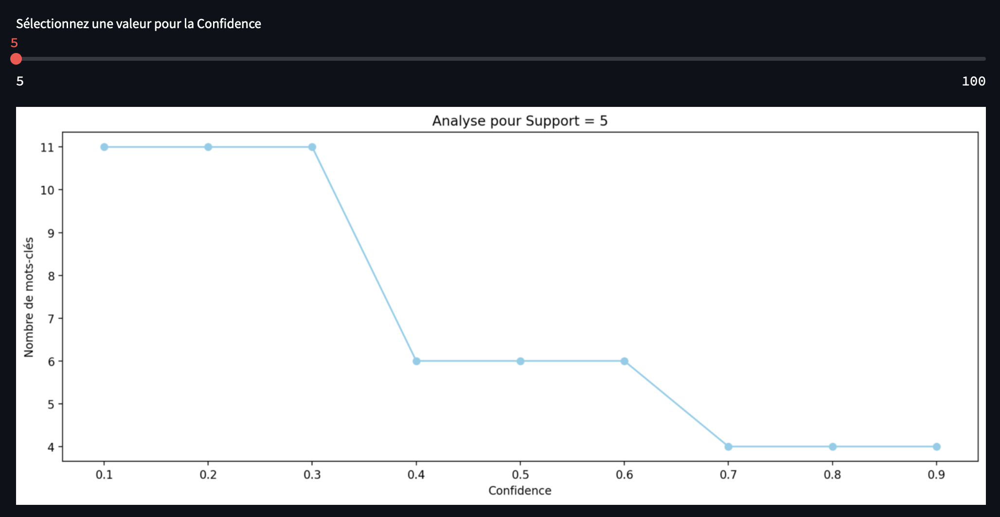
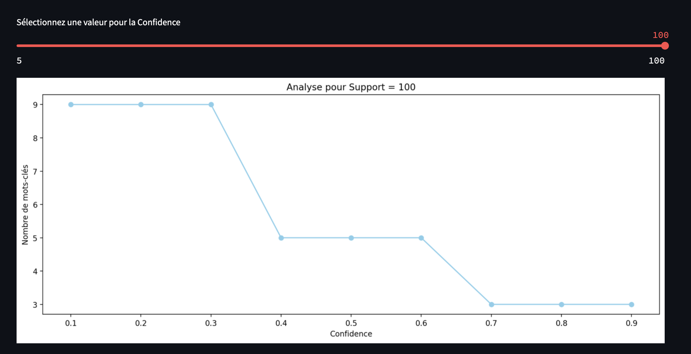
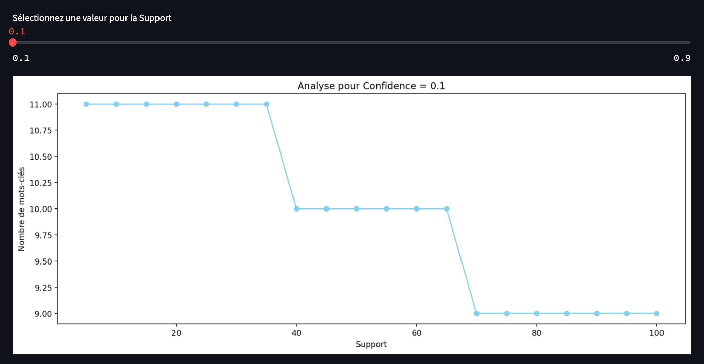
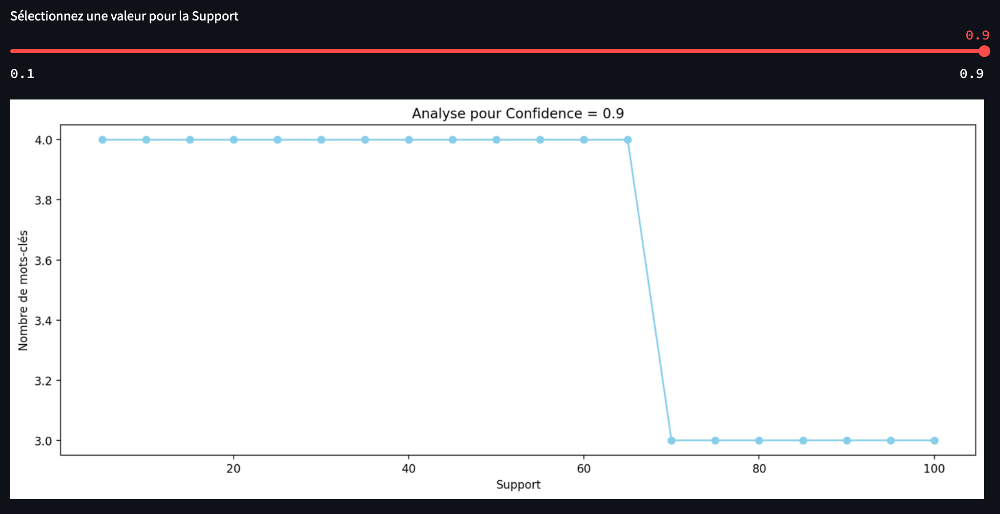
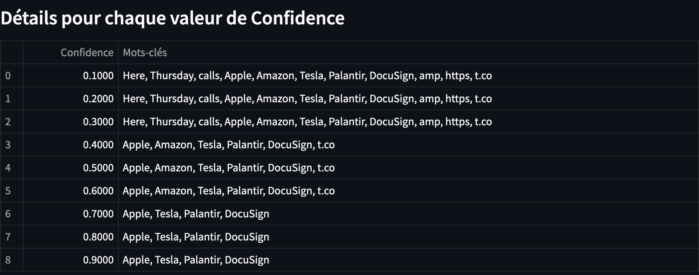
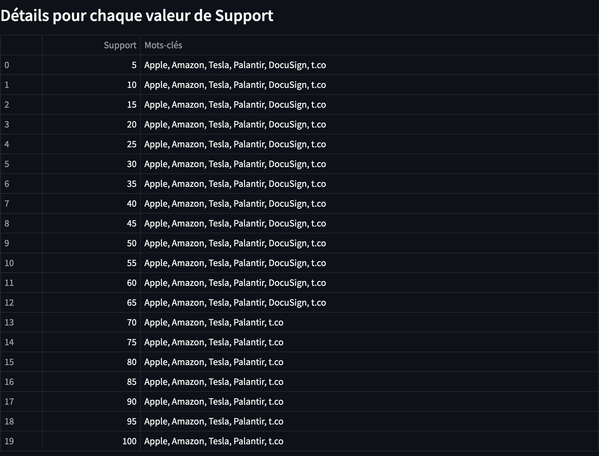

# Rapport TD2 - Annotation sémantique et enrichissement de texte

## Résultats de l'Évaluation

### Performances Globales par Configuration

#### Changement de la confidence




Changer le paramètre de support a peu d'impact sur les performances de l'annotation sémantique. En effet, les résultats sont très similaires dans les deux cas et ce peu importe les paramètres de confidence. Seul quelques mots vont disparaitre quand le support est augmenté, correspondant aux mots dont le nombre de recherches est vraiment très faible.

#### Changement du support




Changer le paramètre de confidence à un fort impact sur les performances de l'annotation sémantique. En effet, les résultats sont très différents dans les deux cas. Ici dans notre exemple nous passons de 11 à 4 mots entre une confidence de 0.1 et 0.9. Nous remarquons aussi encore une fois que l'évolution du support ne change elle qu'un petit nombre de mots.

##### Mots

Voila une analyse des différents paramètres sur un tweet précis :

```text
Here are Thursday's biggest analyst calls: 
Apple, Amazon, Tesla, Palantir, DocuSign, Exxon & more https://t.co/QPN8Gwl7Uh
```



Ici nous voyons que la meilleure confidence semble être dans la range de 0.4 à 0.6. En effet, nous alors 6 mots annotés, ce qui semble être un bon compromis entre le nombre de mots annotés et la pertinence de ces annotations. De plus les mots comme comme "here" "calls" ou "Thursday" disparaissent, ce qui semble être une bonne chose. Au dela, le mot "Amazon" disparait aussi, hors il semble être un mot important dans cette phrase.



En se plaçant donc avec une confidence de 0.5, nous faisont varier ici le support. La seule différence est la disparition de "DocuSign" au dela de 70. Hors ce mot semble être important. La meilleure range semble donc celle en dessous.