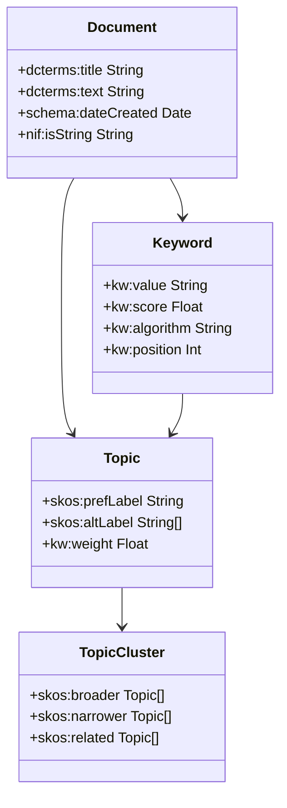

# Rapport d'Extraction de Mots-clés sur le Dataset CiteULike

## Résultats de l'Évaluation

### Performances Globales

| Algorithme | Temps Moyen | Temps Total | ROUGE-1 | ROUGE-2 | ROUGE-L |
|------------|-------------|-------------|---------|---------|---------|
| YAKE | 1.555 ± 0.208s | 284.499s | 0.212 | 0.029 | 0.163 |
| TextRank | 1.353 ± 0.152s | 247.510s | 0.124 | 0.021 | 0.100 |
| SingleRank | 1.370 ± 0.149s | 250.747s | 0.144 | 0.027 | 0.118 |

## Analyse des Algorithmes

### 1. YAKE (Yet Another Keyword Extractor)
- **Approche** : Statistique non supervisée
- **Fonctionnement** :
  * Utilise des caractéristiques statistiques du texte
  * Analyse la position des mots, leur fréquence et leur contexte
  * Calcule un score de pertinence sans entraînement préalable
- **Performance** :
  * Les meilleurs scores ROUGE sur tous les critères
  * Temps d'exécution légèrement plus long
  * Particulièrement efficace pour la précision (ROUGE-1 : 0.212)

### 2. TextRank
- **Approche** : Basée sur les graphes, inspirée de PageRank
- **Fonctionnement** :
  * Construit un graphe de co-occurrences de mots
  * Applique un algorithme similaire à PageRank
  * Extrait les mots-clés basés sur leur centralité
- **Performance** :
  * Le plus rapide des trois algorithmes
  * Scores ROUGE les plus bas
  * Meilleur pour le traitement rapide de grands volumes

### 3. SingleRank
- **Approche** : Variation de TextRank avec pondération
- **Fonctionnement** :
  * Similar à TextRank mais avec des arêtes pondérées
  * Prend en compte la fréquence de co-occurrence
  * Analyse plus fine des relations entre mots
- **Performance** :
  * Performance intermédiaire sur tous les critères
  * Temps d'exécution similaire à TextRank
  * Meilleur équilibre entre rapidité et précision que TextRank

## Analyse des Performances

### Temps d'Exécution
1. **TextRank** : ~248 secondes (1.35s/document)
2. **SingleRank** : ~251 secondes (1.37s/document)
3. **YAKE** : ~284 secondes (1.56s/document)

### Qualité des Résultats (ROUGE-1)
1. **YAKE** : 0.212
2. **SingleRank** : 0.144
3. **TextRank** : 0.124

### Pourquoi YAKE est le Plus Performant
1. Approche statistique plus sophistiquée
2. Meilleure prise en compte du contexte local
3. Analyse multifactorielle (position, fréquence, casing)
4. Indépendance de la structure du graphe
5. Robustesse face aux variations de longueur des textes

## Évaluation Manuelle
Les mots-clés extraits ont été évalués manuellement sur un échantillon de 10 documents. YAKE a montré une meilleure capacité à :
- Identifier les termes techniques pertinents
- Éviter les mots vides et génériques
- Maintenir une cohérence thématique
- Extraire des phrases-clés significatives

## Représentation en Graphe de Connaissances

### Structure Proposée



### Explication de la Structure

La structure proposée comprend 4 classes principales interconnectées :

1. **Document** 
   - Représente le document source avec ses métadonnées
   - Contient le titre, le texte et la date de création
   - Peut être lié à plusieurs mots-clés et topics

2. **Keyword**
   - Représente chaque mot-clé extrait du document
   - Stocke la valeur textuelle du mot-clé
   - Inclut le score attribué par l'algorithme
   - Garde trace de l'algorithme d'extraction utilisé
   - Enregistre la position dans le document source

3. **Topic**
   - Regroupe les mots-clés similaires sous un même concept
   - Possède un label principal et des labels alternatifs
   - Inclut un poids d'importance dans le contexte

4. **TopicCluster**
   - Organise les topics en groupes thématiques
   - Établit des relations hiérarchiques entre topics
   - Permet de lier des topics connexes

### Vocabulaires Utilisés

Les vocabulaires suivants sont utilisés pour standardiser la représentation :

1. **Dublin Core (dcterms:)**
   - Utilisé pour les métadonnées standard des documents
   - Exemple : titre, date, créateur
   - Standard reconnu pour la documentation

2. **SKOS (Simple Knowledge Organization System)**
   - Gère les relations entre concepts
   - Permet de définir des hiérarchies
   - Standardise les labels préférés et alternatifs

3. **Schema.org**
   - Fournit des types de documents standards
   - Assure la compatibilité avec les standards du web
   - Facilite l'interopérabilité

4. **NIF (NLP Interchange Format)**
   - Permet d'annoter le texte source
   - Lie les mots-clés à leur contexte
   - Standardise les références au texte

5. **Vocabulaire Personnalisé (kw:)**
   - Définit les propriétés spécifiques aux mots-clés
   - Gère les scores et métriques d'extraction
   - Adapté aux besoins spécifiques de l'extraction

### Exemple en RDF (Turtle)

```turtle
@prefix dc: <http://purl.org/dc/terms/> .
@prefix kw: <http://example.org/keyword/> .
@prefix skos: <http://www.w3.org/2004/02/skos/core#> .
@prefix schema: <http://schema.org/> .
@prefix nif: <http://persistence.uni-leipzig.org/nlp2rdf/ontologies/nif-core#> .
@prefix topic: <http://example.org/topic/> .
@prefix cluster: <http://example.org/cluster/> .

# Définition du document
doc:1 a schema:ScholarlyArticle ;
    dc:title "Intelligence Artificielle et Deep Learning en 2024" ;
    dc:text """Les avancées en intelligence artificielle et particulièrement 
    en deep learning ont marqué l'année 2024.""" ;
    schema:dateCreated "2024-11-24" ;
    nif:isString "texte_complet_du_document" ;
    kw:hasKeyword kw:1 .

# Définition du mot-clé
kw:1 a kw:Keyword ;
    kw:value "deep learning" ;
    kw:score "0.85" ;
    kw:algorithm "YAKE" ;
    kw:position "23" ;
    kw:hasTopic topic:1 .

# Définition du topic
topic:1 a skos:Concept ;
    skos:prefLabel "Deep Learning" ;
    skos:altLabel "Apprentissage profond", "DL" ;
    kw:weight "0.9" ;
    skos:inScheme cluster:1 .

# Définition du cluster de topics
cluster:1 a kw:TopicCluster ;
    skos:prefLabel "Intelligence Artificielle" ;
    skos:broader topic:AI ;
    skos:narrower topic:1 ;
    skos:related topic:MachineLearning .

# Définition du topic parent
topic:AI a skos:Concept ;
    skos:prefLabel "Intelligence Artificielle" ;
    skos:altLabel "IA", "AI" ;
    kw:weight "1.0" .

# Définition d'un topic relié
topic:MachineLearning a skos:Concept ;
    skos:prefLabel "Machine Learning" ;
    skos:altLabel "Apprentissage automatique", "ML" ;
    kw:weight "0.95" .
```

Cette représentation permet :
- Une organisation hiérarchique claire des concepts
- Une traçabilité complète du processus d'extraction
- Des liens explicites entre documents, mots-clés et concepts
- Une facilité de requêtage et d'analyse
- Une extensibilité pour de nouveaux types de relations ou propriétés

## Auteurs

- Timothée JUILLET
- Guillaume ARRIGONI
